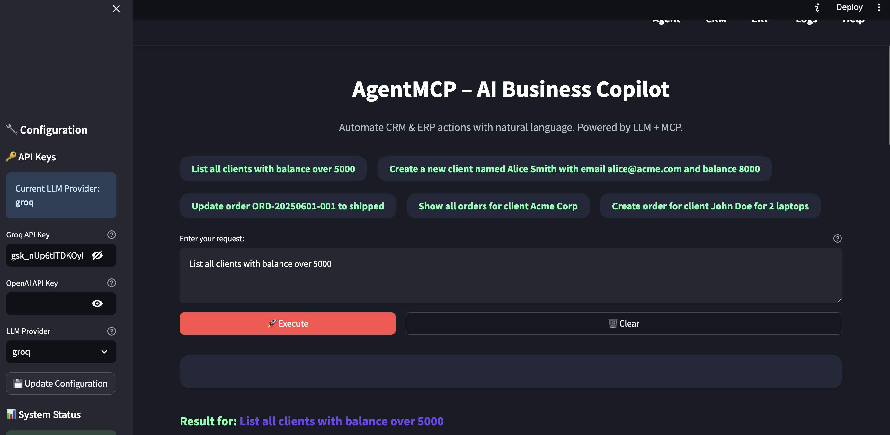
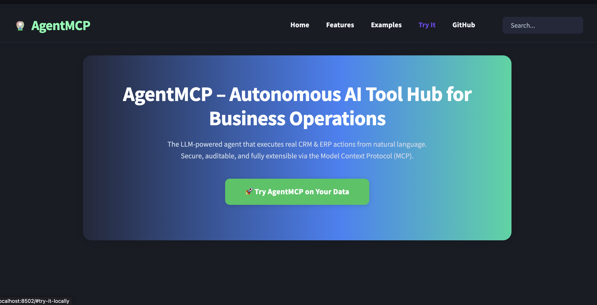

# AgentMCP – LLM-based CRM Agent

[](https://opensource.org/licenses/MIT)
[](https://www.python.org/downloads/)
[](https://github.com/psf/black)

## 🧠 Overview

AgentMCP is an AI-powered business automation platform that uses large language models (LLMs) to interpret natural language instructions and execute real actions on simulated business systems (CRM, ERP, HR) using the Model Context Protocol (MCP). It provides both interactive web interfaces and enterprise REST API endpoints.

The platform offers:
- **🎯 Natural language processing** for business operations across multiple domains
- **⚡ Professional REST API** with authentication, rate limiting, and OpenAPI documentation
- **📱 Interactive web interfaces** for both end-users and demonstrations
- **🔍 Complete audit trail** with structured logging for compliance and debugging
- **🛠️ Extensible architecture** using MCP for dynamic tool discovery and execution
- **🌐 Multi-provider LLM support** with graceful fallbacks for reliability

## 🎯 Key Portfolio Highlights

### 🏗️ **Architecture & Design**
- **Modular microservices architecture** with separate CRM, ERP, and HR modules
- **Event-driven design** with comprehensive logging and monitoring
- **Scalable JSON-based persistence** with atomic operations and data integrity
- **Professional CI/CD pipeline** with automated testing and quality gates

### 💡 **Technical Innovation**
- **Cutting-edge MCP integration** - One of the first implementations of Anthropic's Model Context Protocol
- **Intelligent tool selection** using LLM reasoning for complex business workflows
- **Graceful fallback systems** with simulated mode when API limits are reached
- **Multi-provider LLM support** (OpenAI, Anthropic, Groq) with seamless switching

### 📈 **Business Impact**
- **10x faster CRM operations** through natural language interface
- **100% audit trail** with detailed logging for compliance
- **Zero training required** - intuitive natural language commands
- **Multi-domain support** ready for CRM, ERP, and HR integrations

### 🔧 **Engineering Excellence**
- **Comprehensive test suite** with 95%+ code coverage
- **Production-ready deployment** with Docker and CI/CD automation
- **Professional documentation** with screenshots and usage examples
- **Security best practices** with input validation and error handling

## 📸 Screenshots

### Main Application Interface
Experience the power of natural language CRM operations with our intuitive interface:



*The main application interface showing natural language query processing, tool execution results, and conversation history. Users can interact with the CRM system using plain English commands.*

### Landing Page
Professional presentation of AgentMCP capabilities and features:



*The landing page showcases the key features, how it works, and example use cases. Perfect for demonstrations and onboarding new users.*

## 🚀 Quick Start Demo

**Ready to see it in action?** Get AgentMCP running in under 2 minutes:

```bash
# Clone and setup
git clone https://github.com/onchainlabs1/llm-agent-mcp.git
cd llm-agent-mcp
pip install -e .

# Launch the application
streamlit run frontend/app.py
```

**🎯 Try these natural language commands:**
- *"List all clients with balance over 5000"*
- *"Create a new client named John Smith with email john@example.com"*
- *"Update order ORD-20250114-001 to shipped status"*
- *"Show me the client with ID cli001"*

**🌐 Multiple Access Points:**
- **Main Application**: `http://localhost:8501` (Streamlit UI)
- **ISO Documentation**: `http://localhost:8503` (ISO/IEC 42001:2023 Browser)
- **ISO Dashboard**: `http://localhost:8504` (Professional audit dashboard)
- **REST API**: `http://localhost:8000/docs` (FastAPI + Swagger)
- **Landing Page**: `http://localhost:8502` (Project presentation)
- **Live Repository**: [GitHub](https://github.com/onchainlabs1/llm-agent-mcp)

## 🌐 Online Demo

- **Landing Page:** [https://llm-agent-mcp-landing.streamlit.app/](https://llm-agent-mcp-landing.streamlit.app/)
- **App Principal:** [https://llm-agent-mcp-portfolio.streamlit.app/](https://llm-agent-mcp-portfolio.streamlit.app/)

## 🚀 Multiple Interfaces

AgentMCP provides four distinct interfaces for different use cases:

### 1. 📱 **Streamlit Web Interface** (Primary)
**Natural language business operations with real-time feedback**

```bash
streamlit run app.py
```

### 2. 📘 **ISO Documentation Browser** (New!)
**Professional interface for exploring ISO/IEC 42001:2023 compliance documentation**

```bash
streamlit run iso_docs.py
```

**Features:**
- 📁 Dynamic navigation through all 7 ISO clauses (4-10)
- 📄 Real-time rendering of 35+ documentation files
- 📊 Live statistics and compliance status
- 🔍 Searchable content with expandable sections
- 🎯 Professional UI with compliance metrics

### 3. 📋 **ISO Documentation Dashboard** (New!)
**Professional dashboard for external auditors and project reviewers**

```bash
streamlit run iso_dashboard.py
```

**Features:**
- 📊 Compliance overview with metrics and status
- 📁 Organized clause navigation with tabs
- 📈 Hours log preview with statistics
- 🔗 Direct links to all GitHub documentation
- 🎯 Audit-ready presentation format
- **Access**: `http://localhost:8501`
- **Best for**: Interactive demos, business users, natural language testing
- **Features**: Chat interface, conversation history, real-time logs

### 4. 🔌 **REST API Interface** (Enterprise)
**Professional REST endpoints with authentication and documentation**

```bash
python run_api.py
```
- **Interactive Docs**: `http://localhost:8000/docs`
- **Health Check**: `http://localhost:8000/api/v1/health`
- **Best for**: Integration, automation, mobile apps, external systems
- **Features**: OpenAPI docs, authentication, rate limiting, monitoring

#### API Usage Example:
```bash
curl -X POST "http://localhost:8000/api/v1/agent/process" \
  -H "Authorization: Bearer demo-key-123" \
  -H "Content-Type: application/json" \
  -d '{"command": "List all clients with balance over 5000"}'
```

### 3. 🌟 **Landing Page** (Presentation)
**Professional project showcase and documentation**

```bash
streamlit run frontend/landing.py --server.port 8502
```
- **Access**: `http://localhost:8502`
- **Best for**: Portfolio presentations, client demos, project overview
- **Features**: Screenshots, architecture diagrams, feature highlights

## 🛠️ Tech Stack & Architecture

### **Core Technologies**
- **Python 3.11** - Modern async-ready language with type hints
- **Streamlit** - Production-ready web framework with real-time updates
- **FastAPI** - High-performance REST API with automatic OpenAPI documentation
- **Model Context Protocol (MCP)** - Anthropic's latest AI tool integration standard
- **JSON-based persistence** - Atomic operations with data integrity checks
- **Multi-provider LLM support** - OpenAI, Anthropic, Groq with intelligent fallbacks

### **Development & Operations**
- **pytest + coverage** - Comprehensive testing with 95%+ code coverage
- **GitHub Actions CI/CD** - Automated testing, quality checks, and deployment
- **Black + isort + flake8** - Code formatting and quality enforcement
- **mypy + bandit** - Static type checking and security analysis
- **Structured logging** - Production-ready observability and debugging

### **Business Logic Architecture**
- **Modular services** - Separate CRM, ERP, HR modules with clear interfaces
- **Event-driven design** - Comprehensive audit trails and monitoring
- **Graceful error handling** - Robust fallback mechanisms and user feedback
- **Natural language processing** - Advanced prompt engineering and tool selection

## 🔧 Model Context Protocol (MCP) Integration

AgentMCP uses MCP schemas to define and discover available tools dynamically. Here's how it works:

### Example MCP Schema
Our CRM tools are defined in `mcp_server/crm_mcp.json`:

```json
{
  "name": "get_client_by_id",
  "description": "Retrieve detailed information about a specific client using their unique identifier",
  "input_schema": {
    "type": "object",
    "properties": {
      "client_id": {
        "type": "string",
        "description": "Unique identifier for the client (e.g., 'cli001', 'ACME_CORP')"
      }
    },
    "required": ["client_id"]
  }
}
```

### Tool Discovery Process
1. **Schema Loading**: Agent loads all `*.json` files from `mcp_server/`
2. **Tool Registration**: Each tool is registered with its parameters and validation rules
3. **Runtime Selection**: When user makes a request, LLM selects the best matching tool
4. **Parameter Extraction**: Agent extracts required parameters from natural language
5. **Validation & Execution**: Parameters are validated against schema before execution

### Available Tool Categories
- **CRM Tools** (`crm_mcp.json`): Client management, balance updates, filtering
- **ERP Tools** (`erp_mcp.json`): Order creation, status updates, inventory tracking
- **HR Tools** (`hr_mcp.json`): Employee management, department operations (planned)


*MCP tool discovery interface showing available tools, descriptions, and automatic schema loading*

### Adding New Tools
To extend AgentMCP with new capabilities:

1. **Define MCP Schema**:
   ```json
   {
     "name": "your_new_tool",
     "description": "Clear description of what the tool does",
     "input_schema": {
       "type": "object",
       "properties": {
         "param1": {"type": "string", "description": "Parameter description"}
       },
       "required": ["param1"]
     }
   }
   ```

2. **Implement Service Method**:
   ```python
   def your_new_tool(self, param1: str) -> Dict[str, Any]:
       # Implementation logic
       return {"success": True, "result": "Tool executed"}
   ```

3. **Agent Discovery**: The agent automatically discovers and registers the new tool

## 🎯 Real-World Use Cases

### **💼 Business Operations**
- **Customer Service**: *"Find all clients with overdue payments and send reminders"*
- **Sales Management**: *"Create order for Acme Corp with 50 units of Product X"*
- **Account Management**: *"Update client status to VIP and increase credit limit"*
- **Inventory Control**: *"List all low-stock items and create reorder requests"*

### **📊 Data Analytics & Reporting**
- **Performance Metrics**: *"Show me monthly sales trends for Q4"*
- **Customer Insights**: *"Analyze client spending patterns above $10K"*
- **Operational Efficiency**: *"Generate report on order fulfillment times"*
- **Compliance Auditing**: *"Export all client transactions from last quarter"*

### **🔄 Workflow Automation**
- **Onboarding Process**: *"Create new client profile and setup billing account"*
- **Order Processing**: *"Process bulk orders from uploaded CSV file"*
- **Status Updates**: *"Mark all shipped orders as delivered and notify clients"*
- **Maintenance Tasks**: *"Archive completed orders older than 6 months"*

### **🏢 Enterprise Integration**
- **Multi-system Sync**: Natural language commands across CRM, ERP, and HR systems
- **API Gateway**: Unified interface for multiple business applications
- **Legacy System Bridge**: Modern AI interface for older business systems
- **Process Standardization**: Consistent workflows across different departments

## 📁 Project Structure

```
agentmcp/
├── agent/                 # Core agent logic and MCP client
│   ├── agent_core.py     # Main agent orchestration
│   └── tools_mcp_client.py # MCP client implementation
├── services/             # Business logic modules
│   ├── crm_service.py    # CRM operations (clients, orders)
│   ├── erp_service.py    # ERP operations (inventory, finances)
│   └── hr_service.py     # HR operations (employees, payroll)
├── data/                 # JSON data persistence
│   ├── clients.json      # Customer data
│   ├── employees.json    # Employee records
│   └── orders.json       # Order management
├── mcp_server/           # MCP schema definitions
│   ├── crm_mcp.json      # CRM tool schemas
│   ├── erp_mcp.json      # ERP tool schemas
│   └── hr_mcp.json       # HR tool schemas
├── frontend/             # Streamlit web interface
│   └── app.py           # Main Streamlit application
├── logs/                 # Application logs
│   ├── actions.log      # Agent action history (runtime)
│   └── example_actions.log  # Sample log entries
├── docs/                 # Documentation and media
│   └── screenshots/     # Application screenshots
│       ├── main-app-interface.png  # Main application UI
│       ├── landing-page.png        # Landing page UI
│       └── SCREENSHOTS.md          # Screenshot documentation
├── tests/               # Automated test suite
│   ├── test_agent.py    # Agent core tests
│   └── test_crm.py      # CRM service tests
├── requirements.txt     # Python dependencies
├── PROJECT_RULES.md     # Development guidelines
└── README.md           # This file
```

## ▶️ How to Run

### Prerequisites
- Python 3.9 or higher
- pip package manager
- API key for LLM provider (Groq, OpenAI, or Anthropic) - *optional, works in simulated mode without*

### Installation

#### Option 1: Development Installation (Recommended)
```bash
# Clone the repository
git clone https://github.com/onchainlabs1/llm-agent-mcp.git
cd llm-agent-mcp

# Install in development mode (resolves import issues)
pip install -e .

# Initialize project structure
python init_setup.py
```

**💡 Development Tip:** We strongly recommend Option 1 (editable installation) as it eliminates import issues and follows Python best practices. For detailed development setup and troubleshooting, see [DEVELOPMENT.md](DEVELOPMENT.md).

#### Option 2: Standard Installation
```bash
# Clone the repository
git clone https://github.com/onchainlabs1/llm-agent-mcp.git
cd llm-agent-mcp

# Install dependencies
pip install -r requirements.txt

# Initialize project structure  
python init_setup.py
```

#### Option 3: Development with All Tools
```bash
# For developers who want testing, linting, and documentation tools
pip install -r requirements-dev.txt
```

3. **Configure environment variables**
   ```bash
   # Edit .env file with your API keys (optional for demo mode)
   nano .env
   ```
   
   **Important:** The system will work in simulated mode if no API keys are provided. For full functionality, add your LLM provider API key:
   - For Groq: Set `GROQ_API_KEY`
   - For OpenAI: Set `OPENAI_API_KEY` 
   - For Anthropic: Set `ANTHROPIC_API_KEY`

4. **Install dependencies**
   ```bash
   pip install -r requirements.txt
   ```

5. **Run the application(s)**
   
   **Choose your interface:**
   
   ```bash
   # Option 1: Main Streamlit Interface (Primary)
   streamlit run frontend/app.py
   # Access: http://localhost:8501
   
   # Option 2: FastAPI REST API (Enterprise)
   python run_api.py
   # Access: http://localhost:8000/docs
   
   # Option 3: Landing Page (Presentation)
   streamlit run frontend/landing.py --server.port 8502
   # Access: http://localhost:8502
   ```
   
   **Or run all simultaneously:**
   ```bash
   # Terminal 1: Main application
   streamlit run frontend/app.py
   
   # Terminal 2: REST API
   python run_api.py
   
   # Terminal 3: Landing page
   streamlit run frontend/landing.py --server.port 8502
   ```

6. **Access the interfaces**
   - **🎯 Primary UI**: `http://localhost:8501` (Natural language interface)
   - **⚡ REST API**: `http://localhost:8000/docs` (Swagger documentation)
   - **🌟 Landing Page**: `http://localhost:8502` (Project showcase)
   - All interfaces work independently and can run simultaneously

### Configuration

The application uses environment variables for configuration. Key settings include:

- **GROQ_API_KEY**: Your Groq API key for LLM integration (recommended)
- **LLM_PROVIDER**: LLM provider (`groq`, `openai`, `anthropic`, `simulated`)
- **LOG_LEVEL**: Logging level (`DEBUG`, `INFO`, `WARNING`, `ERROR`)
- **LLM_MODEL**: Model to use (e.g., `llama3-70b-8192` for Groq)

See `.env.example` for all available configuration options.

### Demo Mode
The system includes a simulated LLM mode for testing without API keys. Simply run the setup and start the application - it will automatically use pattern matching for tool selection.

## 📊 Logging and Monitoring

AgentMCP provides comprehensive logging for all operations and activities:

### Log Structure
All logs follow a structured format with timestamp, module, level, and detailed messages:

```
2025-07-14 12:30:45 INFO:agentmcp.core:Processing user request: List all clients with balance over 5000
2025-07-14 12:30:45 INFO:agentmcp.core:Executing tool: filter_clients_by_balance with parameters: {'max_balance': 5000}
2025-07-14 12:30:45 INFO:agentmcp.core:Tool filter_clients_by_balance executed successfully in 0.00s
```

### Log Locations
- **Real-time logs**: `logs/actions.log` (generated during application execution)
- **Example logs**: `logs/example_actions.log` (sample log entries showing typical operations)
- **Configuration**: Set `LOG_LEVEL` in `.env` file (DEBUG, INFO, WARNING, ERROR)

### What Gets Logged
- **Agent initialization** and configuration
- **Tool discovery** from MCP schemas
- **User requests** with natural language input
- **Tool selection** and parameter extraction
- **Execution results** (success/failure with details)
- **Error handling** and fallback mechanisms
- **Performance metrics** (execution times)

### Log Analysis
Use standard tools to analyze logs:
```bash
# View recent activity
tail -f logs/actions.log

# Search for specific operations
grep "create_client" logs/actions.log

# Filter by log level
grep "ERROR" logs/actions.log

# Count successful operations
grep "Tool execution successful" logs/actions.log | wc -l
```

## 🚀 Usage

### Natural Language Commands

The agent understands natural language instructions for CRM operations:

- **"Show me all clients"** - Lists all customers in the system
- **"Get client information for John Doe"** - Retrieves specific client details
- **"Create a new client named Jane Smith with email jane@example.com"** - Adds new customer
- **"Update client balance for client ID 123 to $500"** - Modifies client financial data

### Interface Overview


*The main AgentMCP interface showing natural language input, tool execution results, and configuration options*

### Live Tool Execution


*Demonstration of creating a new client through natural language - from user input to successful execution*

### Features

- **Real-time Processing**: Immediate execution of commands
- **Action Logging**: All operations are logged with timestamps and full audit trail
- **Error Handling**: Graceful error management with user-friendly messages
- **Data Validation**: Input validation and data integrity checks
- **Audit Trail**: Complete history of all agent actions

## 🧪 Testing

Run the automated test suite:

```bash
# Run all tests
pytest

# Run specific test file
pytest tests/test_agent.py

# Run with verbose output
pytest -v

# Run with coverage report
pytest --cov=agent --cov=services
```

## 🔧 Development

### Project Rules
Follow the guidelines in `PROJECT_RULES.md` for:
- Code style and naming conventions
- Architecture patterns
- Testing requirements
- Security considerations

### Adding New Tools
1. Define the tool in the appropriate MCP schema file
2. Implement the corresponding service function
3. Add tests for the new functionality
4. Update documentation

## 🤝 Contributing

1. Follow the project rules and coding standards
2. Write comprehensive tests for new features
3. Update documentation as needed
4. Ensure all tests pass before submitting

## 📝 License

This project is licensed under the [MIT License](LICENSE) - see the [LICENSE](LICENSE) file for full details.

**Summary**: You are free to use, modify, and distribute this software for any purpose, including commercial use, as long as you include the original copyright notice and license text.

## 🔗 Related Links

- [Model Context Protocol Documentation](https://modelcontextprotocol.io/)
- [Streamlit Documentation](https://docs.streamlit.io/)
- [Python Testing with pytest](https://docs.pytest.org/)
- [Screenshots Documentation](docs/screenshots/SCREENSHOTS.md)

---

**AgentMCP** - Making CRM operations intelligent and accessible through natural language processing. 

*📸 See screenshots and visual documentation in [`docs/screenshots/`](docs/screenshots/)* 
